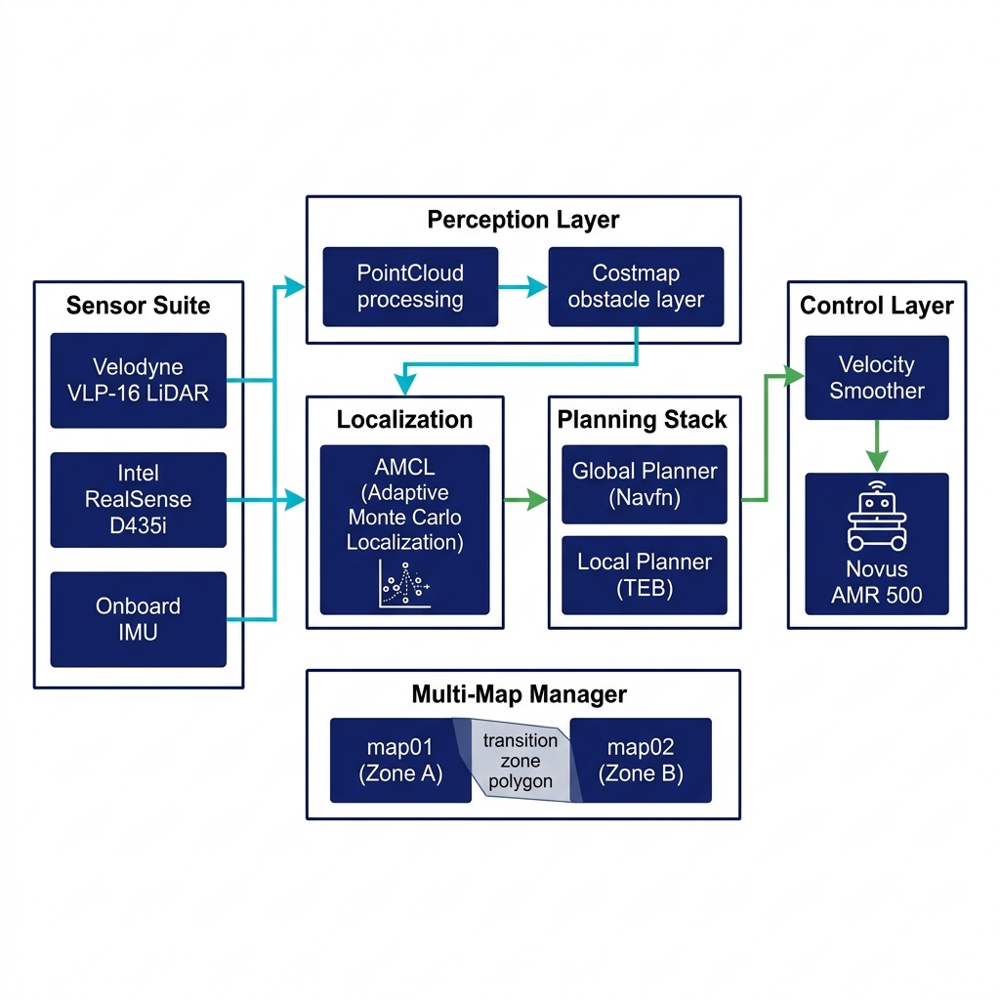

<div align="center">

# Autonomous Mobile Robot Navigation with Dynamic Obstacle Avoidance in Indoor Environments

**Keywords:** `autonomous-navigation` `amcl` `multi-map` `teb-planner` `obstacle-avoidance` `ros-noetic` `lidar` `slam`

</div>

---

## Overview

**Problem Statement:** Large-scale indoor environments (hospital wings, university buildings, warehouses) present unique navigation challenges: GPS-denied localization, dynamic human obstacles, and environments too large for a single SLAM map.

**Motivation:** Existing mobile robot deployments in industry either rely on fixed tracks or limited single-zone autonomy. A scalable, map-agnostic navigation framework that can operate across multiple pre-mapped zones with seamless transitions is essential for practical indoor deployment.

**Key Technical Contribution:** A novel **multi-map navigation framework** using quadrilateral polygon-based transition zone detection and a closed-form 2D rigid-body coordinate transform for automatic re-localization—enabling the Novus AMR 500 to autonomously navigate across independently mapped zones without human intervention. Validated against ISO 3691-4:2020 with all 8 tests passed.

---

## System Overview

<p align="center">
  
</p>

The system integrates four major layers:
1. **Perception** — Velodyne VLP-16 LiDAR + Intel RealSense D435i fused through ROS costmap obstacle layer
2. **Localization** — AMCL (Adaptive Monte Carlo Localization) on pre-built occupancy grid maps
3. **Planning** — NavFn global planner + TEB (Timed Elastic Band) local planner with velocity smoother
4. **Multi-Map Management** — Topological map_manager node monitoring transition polygons and executing rigid-body re-localization

---

## Methodology

### Cognition and Reasoning

The `map_manager` Python node continuously monitors the robot's AMCL pose against pre-defined quadrilateral **trigger polygons** in the active map's coordinate frame. Upon polygon entry, it:
1. Cancels active navigation goals
2. Swaps the map server to the adjacent map
3. Computes a 2D rigid-body transform (rotation + translation) from polygon-pair correspondences
4. Re-initializes AMCL with the transformed pose estimate
5. Executes a small in-place rotation to promote particle convergence
6. Resumes navigation to the original goal in the new map frame

### Perception

Dual-sensor 3D obstacle perception:
- **Velodyne VLP-16 (C16):** 360° horizontal, 16-beam vertical, 100m range — primary long-range environment sensing. PointCloud2 projected to 2D costmap via `pointcloud_to_laserscan`
- **Intel RealSense D435i:** Front-facing depth camera, 0.1–10 m range — close-range obstacle detection covering the robot's front approach zone
- Both sensors fused through unified `obstacle_layer` using logical OR combination with complementary spatial coverage (height range 0.1–2.2 m)

### Planning / Decision Making

- **Global Planner:** NavFn (Dijkstra-based), generates globally optimal path on static costmap
- **Local Planner:** TEB (Timed Elastic Band) running at 20 Hz — deforms trajectories around dynamic obstacles in real time using homotopy-class planning
- **Velocity Smoother:** Custom ROS node applying acceleration limits (linear: 0.05 m/s², angular: 0.3 rad/s²) to prevent wheel slippage and odometry corruption

### Control

Custom `velocity_smoother` node intercepts `cmd_vel` commands from TEB planner and applies exponential ramp-up/ramp-down profiles before forwarding to the Novus AMR 500 base controller, eliminating sudden acceleration spikes that caused odometry drift in single-2D-laser baseline (Project-I).

### Mechanics and Mechanical Design

The Novus AMR 500 is a differential-drive commercial AGV platform. No custom mechanical modifications were made. Sensor mounting brackets were designed for VLP-16 roof mount (0.425 m elevation) and RealSense front-face mount.

### Hardware Platform

| Component    | Details                                         |
| ------------ | ----------------------------------------------- |
| Platform     | Novus AMR 500 (differential-drive, 95 kg payload) |
| Compute      | Intel Core i7, 16 GB RAM, Ubuntu 20.04 LTS      |
| 3D LiDAR     | Velodyne VLP-16 (C16), 360°, 16-ch, 10 Hz      |
| Depth Camera | Intel RealSense D435i, 848×480, 30 fps          |
| IMU          | Onboard 6-DOF IMU                               |
| Middleware   | ROS Noetic                                      |

---

### ISO 3691-4:2020 Compliance — All 8 Tests Passed ✅

| Test ID  | Test Name                            | Result  | Key Metric Achieved               |
|----------|--------------------------------------|---------|-----------------------------------|
| TEST-01  | Same-Map Navigation Accuracy         | ✅ PASS | Mean error: **0.059 m**           |
| TEST-02  | Cross-Map Navigation (Switching)     | ✅ PASS | Switch: 100%, Goal reach: **90%** |
| TEST-03  | Re-Localization After Map Switch     | ✅ PASS | Mean pos. error: **0.074 m**      |
| TEST-04  | Static Obstacle Avoidance            | ✅ PASS | Detection: **100%**               |
| TEST-05  | Dynamic Obstacle Avoidance           | ✅ PASS | Collisions: **0**                 |
| TEST-06  | Path Following (ATE)                 | ✅ PASS | ATE RMSE: **0.090 m**             |
| TEST-07  | E-Stop & Safety Response             | ✅ PASS | Stop time: **~170 ms**            |
| TEST-08  | End-to-End Full Mission              | ✅ PASS | Mission success: **80%**          |

### Key Outcomes

* **100% map-switch trigger accuracy** — All 20 transition zone entries correctly detected by the quadrilateral polygon monitor
* **Mean re-localization error of 0.074 m** achieved using closed-form rigid-body coordinate transform
* **ATE RMSE of 0.090 m** (40% below the 0.15 m threshold) — attributed to velocity smoother eliminating trajectory discontinuities
* **Emergency stop response in ~170 ms** — well within ISO 3691-4 requirements
* System demonstrated FULLY COMPLIANT with ISO 3691-4:2020 driverless industrial truck standard

---

## Demonstration

> Video demonstration to be uploaded. Link will be updated after review.

<div align="center">

[](https://drive.google.com/file/d/1lRLnwmmko3CyA1Een2KCCAjVcBZJ_Aav/view?resourcekey)

**Click above to watch the full demonstration**

</div>

---

## Installation & Setup

### Prerequisites

```bash
# Ubuntu 20.04 LTS + ROS Noetic
sudo apt install ros-noetic-navigation ros-noetic-teb-local-planner \
  ros-noetic-amcl ros-noetic-map-server ros-noetic-move-base \
  ros-noetic-velodyne ros-noetic-realsense2-camera \
  ros-noetic-pointcloud-to-laserscan
```

### Clone and Build

```bash
cd ~/catkin_ws/src
git clone cd ~/MTP2/abc

git clone https://github.com/p1608a/robot_navigation.git
cd ..
catkin_make
source devel/setup.bash
```

### Quick Start

```bash
# launch file of robot bringup is included in every launch file

# 1. Launch navigation stack (single map)
roslaunch robot_navigation navigation_amcl.launch

# 3. Launch multi-map manager
roslaunch robot_navigation multi_map_navigation.launch

# 4. Send a navigation goal via RViz or rostopic
```

See [`code/README.md`](code/README.md) for detailed launch instructions and parameter tuning guide.

---

## Repository Structure

```text
2026-major-amr-navigation/
├── README.md
├── LICENSE
├── code/                   # ROS packages, launch files, configuration
│   ├── robot_navigation/   # move_base, AMCL, costmap configs
│   ├── map_manager/        # Multi-map transition node
│   ├── velocity_smoother/  # Custom velocity smoothing node
│   └── sensor_fusion/      # PointCloud processing nodes
├── report/                 # Thesis PDF and presentation
├── media/                  # Images, diagrams, demo videos
├── docs/                   # Additional technical documentation
├── data/                   # ISO test logs, sample navigation logs
├── hardware/               # Sensor mounting specs, BOM
└── simulation/             # Gazebo simulation environments
```

---

## Thesis Report and Presentation

| Document        | Link |
|-----------------|------|
| Thesis / Report | [report/thesis.pdf](report/Thesis.pdf) |
| Presentation    | [report/presentation.pdf](report/presentation.pdf) |
| ISO Test Report | [data/ISO_3691-4_Test_Report.md](data/ISO_3691-4_Test_Report.md) |

---

## Citation

```bibtex
@mastersthesis{pawan2026amrnav,
  author = {Pawan Kumar},
  title  = {Autonomous Mobile Robot Navigation with Dynamic Obstacle Avoidance in Indoor Environments},
  school = {Indian Institute of Technology Delhi},
  year   = {2026},
  note   = {M.Tech Robotics (JRB), CoE-BIRD}
}
```

---

## Team

| Role          | Name                                                               |
| ------------- | ------------------------------------------------------------------ |
| Student       | Pawan Kumar — M.Tech Robotics (JRB) 2024–26, IIT Delhi             |
| Supervisor    | Pro. S.K Saha, Department of Mechanical Engineering, IIT Delhi     |

---

## Acknowledgements

This work was carried out at the **Centre of Excellence in Biologically Inspired and Robotics Design (CoE-BIRD)**, IIT Delhi. The Novus AMR 500 platform was provided by Hi-Tech Robotic Systemz Ltd. for research purposes.

---

## GitHub Topics

Recommended topics for this repository:
`major-project` · `navigation` · `mobile-robot` · `ros` · `slam` · `amcl` · `teb-planner` · `multi-map` · `obstacle-avoidance` · `iso-3691-4`
